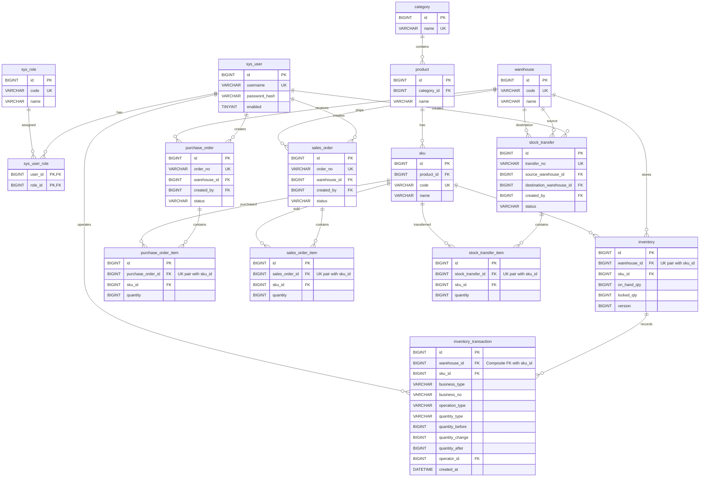

# StockFlow MVP ER 图

对应 [001_init_schema.sql](../backend/database/001_init_schema.sql)。这里只展示关键字段，完整列定义以 SQL 为准。
`||` 表示一个，`o{` 表示零到多个；FK 是外键，UK 是唯一键。

说明：

- inventory_transaction 的外键是 (warehouse_id, sku_id) → inventory 的联合唯一键，不是两个各自独立的引用。
- business_type + business_no 只建立查询索引，不画成外键；它由后续业务代码关联不同类型单据。
- 草稿允许零条明细；提交前至少一条明细由后续业务代码保证。
- 同一 SKU 可在不同仓库有库存。同一订单内，同一 SKU 只占一条明细。
- 图中没有 available_qty，读取时计算 on_hand_qty - locked_qty。
