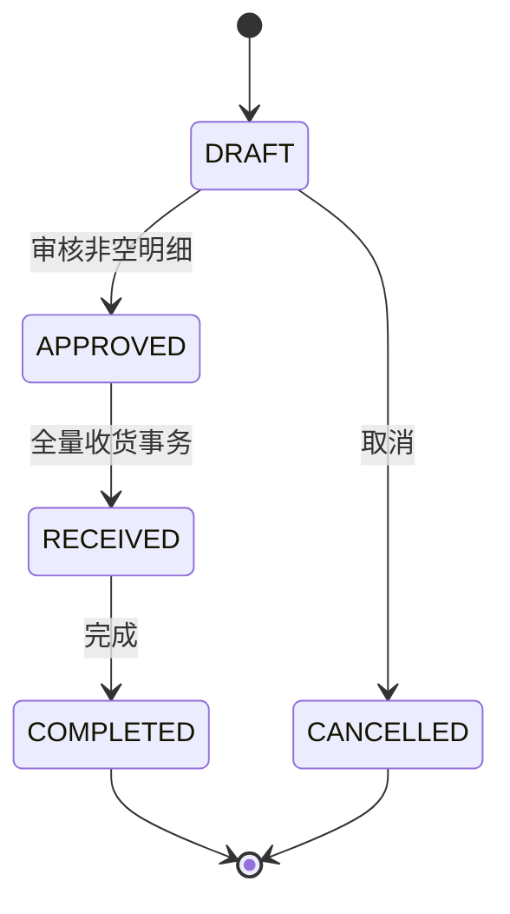

# Issue #5：采购单与事务收货

## 1. 能力与边界

从“采购入库”页面新建草稿，填写收货仓库和备注，再输入已有 SKU 编码与正整数数量。
SKU 编码区分大小写，可从“商品管理 → SKU 管理”复制。每单最多 100 行，同一 SKU 只能出现一次。
草稿允许修改数量、移除明细；不删除整张订单。审核时必须至少有一行，关联商品必须启用。
审核后明细和仓库固定、不允许取消；之后停用商品不会阻止已经审核订单履约。



只有收货改变库存。创建、审核、取消和完成都不会增加库存。
不实现供应商、价格/金额、部分收货、退货、销售、调拨、登录或 RBAC。
订单号由服务端生成，客户端不能指定状态、创建人或收货操作人。

## 2. 升级现有开发库

沿用 Issue #2 的表和 Issue #3 的商品启用字段，没有新表结构迁移。
**已有库不要重复执行 001 / 002，也不要删除重建。**

在 Workbench 使用管理员连接，确认本机项目实例是 127.0.0.1:3307，执行 USE stockflow，
打开并执行 [dev_purchase_operator.sql](../backend/database/dev_purchase_operator.sql)。
脚本只添加一个停用的技术操作者，满足创建人和流水操作人的外键；重复执行不覆盖记录。
password_hash 是不可用于登录的标记，不是密码。后端没有注册、登录或权限管理接口。
所有开发操作归属于此身份，**不能据此区分实际操作者**。

为已有普通应用账户增加以下表级权限（库名/账户名不同则对应替换）：

```sql
GRANT INSERT, UPDATE ON stockflow.purchase_order TO 'stockflow'@'localhost';
GRANT INSERT, UPDATE, DELETE ON stockflow.purchase_order_item TO 'stockflow'@'localhost';
GRANT INSERT, UPDATE ON stockflow.inventory TO 'stockflow'@'localhost';
GRANT INSERT ON stockflow.inventory_transaction TO 'stockflow'@'localhost';
```

保留已有 SELECT 和四张基础资料表权限。不要授予流水 UPDATE/DELETE、库存 DELETE、用户表写入或 DDL。
管理员执行这些 SQL 是环境管理操作；后端继续使用普通账户。

DEV_OPERATOR_USERNAME 默认 stockflow-local-operator。自定义时先准备对应的停用技术身份；
缺失或启用该身份会导致创建/收货返回 503，不会选取任意用户。
以后接入认证时，用服务端认证上下文中的用户替换此机制。

更新后在 VS Code 终端停止并重新启动 Backend 任务；MySQL 可以继续运行。
前端开发服务器通常自动加载代码，再刷新浏览器。
本机启动脚本/工作区不进入仓库，新克隆环境按根 README 启动。

## 3. 实际操作

1. 在分类、商品/SKU、仓库管理中准备基础资料。
2. 进入“采购入库”，新建采购单，选择收货仓库。
3. 添加 SKU 编码和数量，草稿中可修改或移除。
4. 点击“审核采购单”并确认，此时库存不变。
5. 全部货物收到后点击“确认收货”，状态变为“已收货”，下方出现 PURCHASE_IN 流水。
6. 到“库存查询”按仓库及 SKU 查询：实物数量增加、可用数量增加、锁定数量不变。
7. 回到单据点击“完成采购单”，库存不会再次增加。

首次收货创建仓库/SKU 的库存记录，不需要“新建库存”按钮。
例如实物 10、锁定 3，本次收货 5：实物变成 15、锁定仍是 3、可用变成 12。

## 4. API

统一 ApiResponse；列表为 PageResult；详情包含 order、items、transactions。
响应 ID、数量和流水数量为十进制字符串，避免浏览器损失 BIGINT 精度。
请求接受整数 JSON 数字或十进制整数字符串，推荐字符串；小数、负数、零和超出 Long 上限的数量返回 400。

| 方法 | 路径 | 行为 |
| --- | --- | --- |
| GET | /api/purchase-orders | 分页：page 默认 1，size 默认 10、最大 100；可按 warehouseId/status/orderNo 筛选，单号精确匹配 |
| POST | /api/purchase-orders | 草稿：warehouseId、可选 remark（最多 500 字） |
| GET | /api/purchase-orders/{id} | 单据、明细、收货流水 |
| POST | /api/purchase-orders/{id}/items | 草稿加行：skuCode、quantity |
| PUT | /api/purchase-orders/{id}/items/{itemId} | 草稿改数量：quantity |
| DELETE | /api/purchase-orders/{id}/items/{itemId} | 草稿移除明细 |
| POST | /api/purchase-orders/{id}/approve | DRAFT → APPROVED |
| POST | /api/purchase-orders/{id}/receive | APPROVED → RECEIVED |
| POST | /api/purchase-orders/{id}/complete | RECEIVED → COMPLETED |
| POST | /api/purchase-orders/{id}/cancel | DRAFT → CANCELLED |

无通用状态更新接口，也无公开库存/流水写接口。
参数错误 400，不存在 404，状态/溢出/并发冲突 409，开发操作者未配置 503。
未知数据库失败 500，内部 SQL 和异常不返回浏览器。

采购接口仅用于本地开发，无登录。Security 仅开放上述明确方法和路径；
采购 JSON 路径豁免 CSRF，不使用 Cookie/HTTP Basic。
CORS 仅允许配置的明确前端地址、不带凭据。CORS 不是身份认证，当前服务不适合多人生产使用。

## 5. 收货事务与并发

入口 PurchaseOrderService.receive 由 Controller 外部调用，Spring 代理开启事务；
rollbackFor = Exception.class 保证异常离开方法时回滚，不在事务中吞掉异常。

1. FOR UPDATE 锁采购单，确认 APPROVED；明细修改和其他动作也先锁同一行。
2. 按 SKU ID 顺序处理明细，避免反向获取多个库存锁。
3. 用库存唯一键 (warehouse_id, sku_id) 建立缺失余额行，重复键分支锁定已有行。
4. FOR UPDATE 读取最新余额，用 Math.addExact 检查数量溢出；增加实物数量和版本，锁定数量不变。
5. 追加 PURCHASE / PURCHASE_IN / ON_HAND 流水，保存前值、增量、后值、单号与操作人。
6. 更新订单为 RECEIVED，事务提交后才返回 HTTP 成功。

三类写入共享 DataSource 和事务。当前使用行锁；version 递增并校验，没有通用乐观锁重试框架。
同一采购单的并发请求串行执行：第一次提交后，第二次看到 RECEIVED 返回 409，业务效果只发生一次。
响应丢失时刷新详情确认状态；重发得到 409 不能推断第一次失败。
不同订单收同一 SKU 时库存锁串行化，数量累计不会互相覆盖。
数据库死锁等临时冲突返回 409，事务回滚，前端刷新后可重试。

流水 Mapper 只有查询/INSERT，普通账户无 UPDATE/DELETE，已有两个触发器保护只追加。
完成和取消不触碰流水。

参考：[Spring 事务注解](https://docs.spring.io/spring-framework/reference/data-access/transaction/declarative/annotations.html)、
[MySQL 锁定读](https://dev.mysql.com/doc/refman/8.0/en/innodb-locking-reads.html)。

## 6. 验证方式

先在 backend 执行 mvn clean package，再从仓库根目录运行：

```powershell
# MySQL 已启动；MYSQL_BIN 可设为 mysql.exe 完整路径
$env:DB_HOST = '127.0.0.1'
$env:DB_PORT = '3307'
$env:DB_USERNAME = 'root'
$testCredential = Get-Credential -UserName root -Message '输入本机 MySQL 测试管理员密码'
$env:DB_PASSWORD = $testCredential.GetNetworkCredential().Password
node backend/database/verify-purchase.mjs
Remove-Item Env:DB_PASSWORD
```

脚本无 npm 依赖，创建随机测试数据库及临时受限应用账户，启动随机端口真实后端，结束自动清理。
管理员仅用于初始化、故障注入和清理；业务 HTTP 服务使用另一个随机普通用户。
不会修改 stockflow 库或停止 8080 上的开发后端。

覆盖合法/非法状态、草稿编辑、重复 SKU、参数与大整数、最小权限、CORS、不可变流水、
同单并发收货、不同单共享库存、首次建立库存的并发以及数量/版本溢出。

回滚验证不是 Mock：仅在临时库加触发器，分别让第二行写流水、最后更新单据状态失败，
比较全部库存、流水、状态、版本和更新时间，确认没有部分提交；删除测试触发器后正常收货。
生产代码无测试失败开关或故障接口。

添加 --interactive 保留临时后端进行浏览器验收。在另一个前端终端将
VITE_API_BASE_URL 设为脚本输出的 API 地址，用 npm run dev -- --port 5174 启动并打开 localhost:5174。
浏览器演示仓 WH-BROWSER 和 BROWSER-SKU 是专用空库存资料。
结束前端后在验收脚本终端按 Enter 清理临时库和后端，下次使用新的 API 地址。
本机已有脚本时，可在 VS Code 执行 ../local-development/Test-PurchaseInbound.ps1 -Interactive。

## 7. 阅读路线

1. PurchaseOrderDetailView.vue → api/purchaseOrders.js：追踪点击收货后的请求。
2. PurchaseOrderController：HTTP 方法、路径参数、请求体与校验。
3. PurchaseStatus 和 PurchaseOrderService：对照状态图读动作前置条件。
4. Inventory.receive：record、long、算术溢出与可用数量。
5. PurchaseReceiptMapper：将 SQL 对应到收货的六步。
6. verify-purchase.mjs：阅读故障注入和并发测试，再在 Workbench 观察结果。

先掌握请求经过前端、Controller、Service、Mapper、MySQL 的路径，再逐段复习语法。
